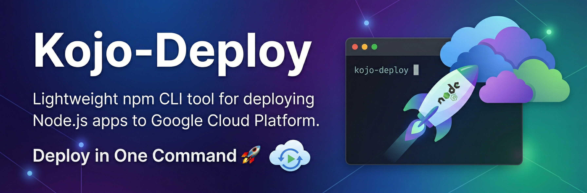

# Kojo-Deploy 🚀

[](https://www.npmjs.com/package/@kojo_shaddy/kojo-deploy)

A lightweight, npm-integrated CLI utility designed to simplify the developer experience when hosting applications on Google Cloud Platform.

## Features
- **One-Command Deployment**: `npm run kojo-deploy` handles everything.
- **Auto-Auth**: Automatically checks and prompts for GCP authentication.
- **Smart Defaults**: Infers service names and project settings.
- **Zero-Config Docker**: Generates a Dockerfile if one is missing.
- **Cloud Run Ready**: Scales your app from zero to hero automatically.
- **Live URL**: Instant production URL provided at the end.
- **Upcoming**: Real-time log streaming with `--logs` flag (coming soon!)


## Prerequisites
- [Node.js](https://nodejs.org/) installed.
- [Google Cloud SDK (gcloud)](https://cloud.google.com/sdk/docs/install) installed.
- A GCP Project with Billing enabled.

## Quick Start
### Option 1
You can deploy your project in seconds without even installing it:
```bash
npx @kojo_shaddy/kojo-deploy 
```

### Option 2
1. **Add Kojo-Deploy to your project:**
   ```bash
   npm install --save-dev @kojo_shaddy/kojo-deploy
   ```

2. **Deploy:**
   ```bash
   npm run kojo-deploy
   ```

## Workflow
1. **Authentication**: Checks if you are logged in; opens browser if not.
2. **Configuration**: Prompts for Project ID and Service Name.
3. **Containerization**: Builds your app using Google Cloud Build.
4. **Deployment**: Deploys the image to Cloud Run (Managed) with unauthenticated access enabled.

## Environment Variables & Secrets
### Local Environment Variables
If a `.env` file is present in your project's root directory, Kojo-Deploy will automatically read it and inject the environment variables into your Cloud Run service during deployment. **Note:** `.env` is typically excluded from version control by `.gitignore` automatically.

### Google Secret Manager Integration
For sensitive values (like database passwords or API keys) in production, you should use Google Secret Manager rather than plain text environment variables. Kojo-Deploy automatically enables the Secret Manager API in your GCP project.

You can securely pass secrets to your service using the `--secrets` flag, mapping the environment variable name to the Secret Manager path:
```bash
npx @kojo_shaddy/kojo-deploy --secrets "DB_PASS=projects/PROJECT_ID/secrets/db_password/versions/latest"
```
If using an npm script, pass the arguments like this:
```bash
npm run kojo-deploy -- --secrets "API_KEY=projects/PROJECT_ID/secrets/my_api_key/versions/latest"
```

## Mission
Kojo-Deploy acts as a "digital engine" for the global tech community, making cloud infrastructure accessible and fast, so engineers can focus on writing code rather than managing consoles.

---
Created with ❤️ by [Shadrack Inusah](https://kojoshaddy.pages.dev/)
