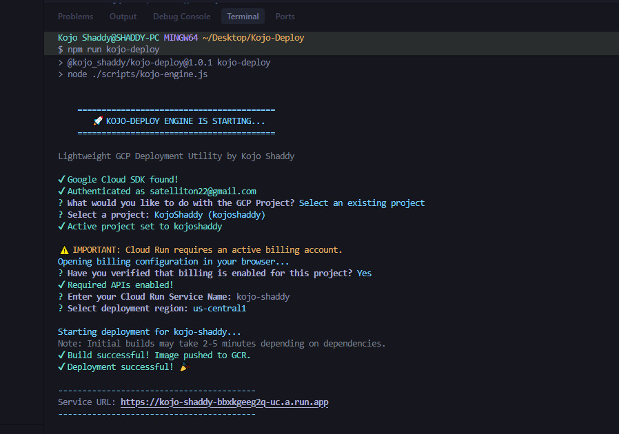

# Kojo-Deploy 🚀

[](https://www.npmjs.com/package/@kojo_shaddy/kojo-deploy)

A lightweight, npm-integrated CLI utility designed to simplify the developer experience when hosting applications on Google Cloud Platform.

## Features
- **One-Command Deployment**: `npm run kojo-deploy` handles everything.
- **Auto-Auth**: Automatically checks and prompts for GCP authentication.
- **Smart Defaults**: Infers service names and project settings.
- **Zero-Config Docker**: Generates a Dockerfile if one is missing.
- **Cloud Run Ready**: Scales your app from zero to hero automatically.
- **Live URL**: Instant production URL provided at the end.



## Prerequisites
- [Node.js](https://nodejs.org/) installed.
- [Google Cloud SDK (gcloud)](https://cloud.google.com/sdk/docs/install) installed.
- A GCP Project with Billing enabled.

## Quick Start

1. **Add Kojo-Deploy to your project:**
   ```bash
   npm install --save-dev @kojo_shaddy/kojo-deploy
   ```
   *Note: Kojo-Deploy automatically adds the deployment script to your `package.json` for you!*

2. **Deploy:**
   ```bash
   npm run kojo-deploy
   ```

## Workflow
1. **Authentication**: Checks if you are logged in; opens browser if not.
2. **Configuration**: Prompts for Project ID and Service Name.
3. **Containerization**: Builds your app using Google Cloud Build.
4. **Deployment**: Deploys the image to Cloud Run (Managed) with unauthenticated access enabled.

## Mission
Kojo-Deploy acts as a "digital engine" for the global tech community, making cloud infrastructure accessible and fast, so engineers can focus on writing code rather than managing consoles.

## For Maintainers
To update this tool and publish a new version to NPM:
1. Make your changes.
2. Run `npm run release`.

---
Created with ❤️ by [Shadrack Inusah](https://kojoshaddy.pages.dev/)
